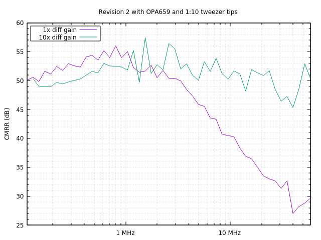
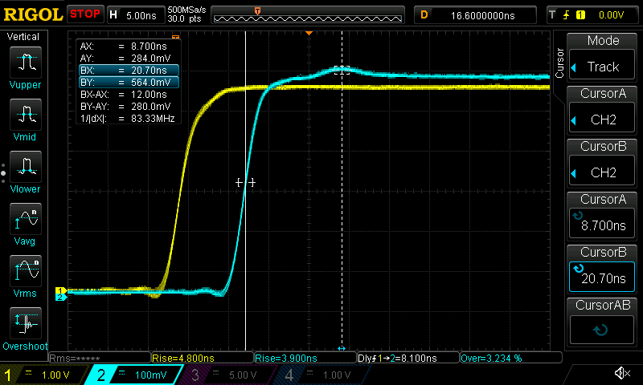
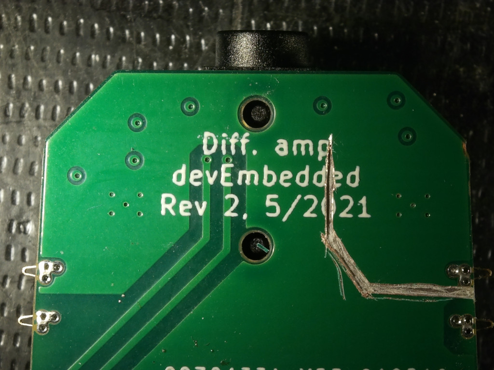
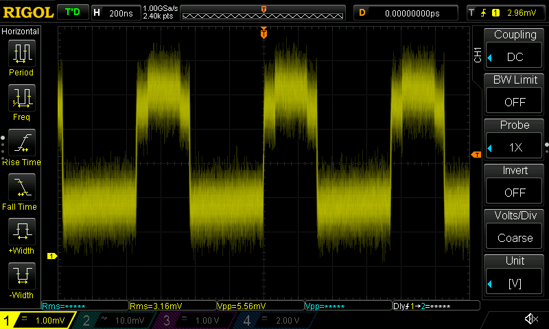

Design notes for differential tweezer
=====================================

Revision 1, 1/2021
------------------

Used OPA810, 10 Mohm input impedance, fixed transfer ratio of 1:10.

Supply was +-12V with R1283C and 47µH inductors.
Power usage 0.4 watts.

Input divider was 1:10.
Based on tests needed 2.3 pF capacitor at the tip when used with 2-6 pF trimmer on the PCB.

Bandwidth in tests was 50MHz.
Capacitors in parallel with R7 and R13 helped to raise it by a couple MHz.

Also tested complex source termination with 68 pF capacitor C23 in parallel
with 50 ohm output resistor. Improved high frequency performance very
slightly but caused issues with response flatness.

At 100MHz, response was -8dB.

CMRR was 80 dB at DC and 16 dB at 50 MHz.

Output noise level is 0.4 mVrms, 2.7 mVp-p.

Delay was 12.6 ns. (CH2 = reference, CH1 = probe out)

Tweezer tips were 140 mm long with angle 3 deg outwards, feels a bit too long and too wide apart.

Soldered triaxial cable directly to solder mount BNC plug, split to USB supply
cable from there and put adhesive heatshrink on it. Result was quite ugly.

Proto with OPA659, 5/2021
-------------------------

Using rev 1 pcb, switched to OPA659 in SOT23-5 package.
Triaxial cable terminated to Cinch 27-9020 clamped BNC plug.
Works quite well but will need some padding around the cables to make them clamp better in place.

Supply +- 6V with R1283C and 10 µH inductors. Power usage 1.37 watts. SOT23-5 opamps noticeably warm.

Changed input divider to 1:21.4 to account for the smaller voltage range.
Input impedance is 10 Mohm.
Probe tip has 1.2 pF, PCB has 8-30pF trimmers.
Added 300 ohm series resistor to tips to compensate for inductance.

U3 stage has 470 ohm to 1000 ohm for 2.14x amplification, bringing the total ratio to 1:10.

Complex termination C23 unassembled.

Response quite flat to 60 MHz. At 100 MHz -20.13 dB, at 200 MHz -30 dB.

CMRR was 80 dB at DC and 35 dB at 50 MHz. This seems better than the 15 dB CMRR specified for OPA659 at 50 MHz.

Noise was 0.8 mVrms, 4.8 mVp-p, about double the value for OPA810.
On the other hand bandwidth is also over double.
Increased noise could also be caused by the 2x amplification in the output stage.

Delay 9.2 ns. Waveform preserved much better than with OPA810 due to flatter response. (CH1 = reference, CH2 = probe out)

Shortened probe tips to 100 mm with angle of 3 deg inwards, feels a bit short.

Test with 1 Mohm input impedance
--------------------------------

To reduce thermal noise, OPA659 proto was modified from 9.1 Mohm : 442 kohm divider to 910 kohm : 43 kohm divider.

Output noise for 43 kohm divider was 0.74 mVrms. Difference to 442 kohm divider (0.78 mVrms) is very small.

Expected thermal noise for 442 kohm divider impedance at 100 MHz bandwidth is 1.7 mVrms on output and for 43 kohm divider impedance 0.5 mVrms. For some reason observed reduction is only 0.040 mVrms.

PSU ripple is 2.2 mVrms, 16 mVp-p on the OPA659 prototype and slightly larger on OPA810 prototype.
Largest noise spike is 1.9 mV at 1.38 MHz operating frequency of R1283C.

OPA659 PSRR is 55 dB at 1.4 MHz, which should give about 0.014 mVrms combined noise on output.
Measurements show 0.02 mVrms spike in output at 1.4 MHz.

On scope the output noise looks quite wideband on FFT, but scope sensitivity is not high enough for accurate measurements. On spectrum analyzer the noise is wideband up to 150 MHz.

Supplying opamps from batteries instead of R1283C lowers noise by about 20% to 0.6 mVrms.

Based on OPA659 datasheet, input equivalent noise voltage for the first stage is
sqrt(4*k*T*R + (Ibn * R)² + En²) = sqrt(712 nV²/Hz + 0.006 nV²/Hz + 8.9 nV²/Hz) which is 0.3 mVrms at 150 MHz bandwidth with 43 kohm divider, dominated by thermal noise in resistor. That should give 0.6 mVrms at output because of the 2x gain, which seems to agree with measurements. But then why doesn't 442 kohm divider give 10x more noise?

Apparently because of https://en.wikipedia.org/wiki/Johnson%E2%80%93Nyquist_noise#Thermal_noise_on_capacitors
The divider capacitors limit the noise bandwidth, even though the signal bandwidth is unaffected.
For 20 pF capacitance on the lower side of the divider, this gives just 0.014 mVrms on input.
Maybe the noise is rather caused by the high side resistor and capacitor?
But even that gets just 0.058 mVrms.
Also if the noise bandwidth was being limited, the measured noise sprectrum shouldn't go up to 150 MHz.

It will be interesting to see how noise behaves when 10x gain mode is added.
That would limit bandwidth to 20 MHz, but on the other hand the increased amplification could increase noise.

Power supply filtering
----------------------

Revision 1 power supply filter had two stages of ferrite + 10µF capacitor.
This filtered high-frequency noise well but let some of the 1.4 MHz switcher noise through.

As a test, one of the ferrites was replaced with 4.7µH inductor to get the cutoff frequency lower.
Based on calculations there will be some oscillation at around 50kHz, but the inductor ESR will limit that.
Because the SMPS shouldn't emit noise at such low frequencies and that the OPA659 PSRR is quite good there, it should be ok.

With two ferrites the ripple (20 MHz measurement bandwidth) was 3.6 mVp-p on +6V and 2.7 mVp-p on -6V.
With second ferrite replaced with 4.7µH inductor, values were 11.0 mVp-p and 13.5 mVp-p.
Not a good change.
Output noise stayed roughly the same, validating the good PSRR of OPA659.

It seems two ferrites is the best strategy.
It should be used on input +5V rail also to avoid emitting noise to the triax cable.

Searching for noise source
--------------------------

1. Buffer stage opamp inputs were shorted to ground to test for noise.
Noise level did not change significantly.
This means that most of the noise is not caused by the input thermal noise.

2. The differential stage input resistors were moved to be from GND instead of
first stage outputs. Noise was reduced from 0.75 mVrms to 0.65 mVrms.

3. A 0.5 pF capacitor was added as C21 to bandlimit differential amp bandwidth.
Noise was unaffected.

4. R8 was shorted out, to short differential amp IN+ to GND.
Noise was unaffected.

5. R10 output offset resistor was disconnected.
Noise was unaffected.

6. The shorted-to-ground R13 was removed, changing the differential amp gain to 1.
Noise was increased to 0.8 mVrms.

7. R14 was shorted out, making the differential amp to simple unity gain buffer with 0 ohm feedback.
Noise was reduced to 0.58 mVrms.

8. Output 50 ohm resistor was connected between ground and output, to get a baseline noise reference.
Noise was 0.32 mVrms with power off and 0.33 mVrms with power on and running through the triax.
This matches the noise level of the oscilloscope when 50 ohm termination resistor is directly connected to input.

9. Changes were reverted to normal, except 0.5pF was left in place and inputs were still shorted to GND.
24 Mpts 1GSps capture was taken and FFT was calculated in octave to get more precise noise spectrum.
With this wider capture bandwidth (extending further to low-freq noise below 100kHz), the RMS noise reported by scope was 1.73 mVrms, though for some reason the noise calculated from raw data is only 0.45 mVrms.
Apparently Rigol DS1054Z performs some extremes-keeping decimation on the data and calculates RMS on the decimated values. To get correct RMS values it will have to be done on PC.

There are 3 opamps and output gain of 2.
If the noise is uncorrelated, we can expect it to increase by 2 * sqrt(3) = 3.5x.
Based on graph the base noise appears to be 4x larger than the single amp spec, which agrees with calculations.

However there are some significant peaks in the spectrum. The largest are at 1.37 MHz, 2.74 MHz, 4.11 MHz, 5.48 MHz, 62.5 MHz, 250 MHz, 312 MHz, 438 MHz. Of these the first 4 are the harmonics of the SMPS frequency.
250 MHz spike is probably caused by ADC interleaving of the oscilloscope.

It is easier to evaluate the significance of the peaks by plotting the cumulative noise spectrum:

Based on the graph most of the total noise is caused by the wideband noise between 10 MHz and 100 MHz.
Reducing the power supply spikes is desirable but will not have a huge effect.
Improving the cooling of the opamps will probably help with noise also.

---

Design goals for revision 2
---------------------------

* Make tweezer tips detachable, using spring contacts to pass signal and ground.
* Add pads for inductance compensation resistor to the tips.
* Add 3.5 mm connector for connecting input directly without tweezer tips. Allows use of commonly available shielded audio cables.
* One sided assembly, single PCB. PCB can be longer than currently.
* Add 1x vs. 10x gain switch.
* Use VSON package for OPA659 for better thermal conduction.

Cable input option
------------------

Tweezer tips often provide the lowest capacitance measurement solution, because the capacitor can be very close to the tip. But for general usage spring hooks or 0.65 mm square pins can be more useful.

To suit both cases, rev2 should have detachable tips and a connector for cable.
A 3.5 mm audio connector can be used for the cable, because shielded audio cables are commonly available.
Because of the short length (about 10 cm) the uncontrolled impedance does not matter at these frequencies.
The capacitors at the tip of the cable must be selected to match cable capacitance.

It will also be useful if normal oscilloscope probes can be connected to the input.
This is possible if the impedance is close to 1 Mohm || 12 pF.

The cable input should be protected against ESD and overvoltage up to some reasonable limit.
The OPA659 input ESD resistors can handle up to 30 mA current, so the 499kohm series resistor
should provide quite good protection.

Tweezer tip attachment
----------------------

To work well, the tweezer tips must be held in place well, and always at the correct alignment so that the tip ends meet. A machine taper is commonly used for this purpose in e.g. drill presses. This can be emulated in 2D with the PCB tips and 3D printed enclosure.

The tips have to be aligned both in angle and in insertion depth. For this purpose a notch can be added to the PCBs to lock them in place once fully inserted. The enclosure will have to flex a bit to account for the +- 0.2 mm dimension accuracy of the PCBs.

I don't know how to choose the taper angle. 1.5 degrees per side seems to be used for metals, maybe I'll try 3 degrees per side at first.

Enclosure design
----------------

IEC61010 requires enclosure to be UL94 V-1 rated. My 3D print supplier charges a bit more for such material, and it is only available in white color. The required thickenss for UL94 V-1 rating is 2 mm. To save on setup costs, I think I'll try to make the enclosure out of two identical halves. This means that one side will have unnecessary holes for switch and trimmers, but they can be covered by a label. Connectors must be aligned on centerline.

Gain switch
-----------

The circuit is typical instrumentation amplifier configuration, where differential gain can be adjusted by adding a resistor network in negative feedback between the two front-end amplifiers. This needs just the addition of a switch and resistors so is a pretty cheap feature.

The height from PCB surface to 3.5mm connector center is 2.3 mm. With a symmetric enclosure and 1.6 mm PCB, this means 8.2 mm from PCB surface to opposite side enclosure surface.

There aren't many small SMD switches with these specs.
But 78HF01GWRT seems suitable at 7.6 mm height.
It also specifies a capacitance of 2 pF, which is acceptable for the 220 ohm impedance feedback node.

Offset adjust
-------------

OPA659 can have up to +-5 mV input offset at room temperature.
First revision had offset trimmer on output.
This works, but it would cause a large shift in offset when gain is switched between 1x and 10x.

Input offset adjust trimmer was added on positive input side.
Leaving negative side with 0V offset allows single-ended use by touching only positive probe to signal.
The small capacitance and resistance imbalance between positive and negative input will be trimmed out along with other inaccuracies.

Trimmer wipers
--------------

Trimmer capacitors and potentiometers are arranged so that their wipers are at ground potential.
This allows using conductive adjustment tools without disturbing the circuit operation.

And exception is the input offset trimmer. 100nF capacitor was added to the wiper so that most noise
is filtered out. X7R dielectric has some microphonic effect, but because there is 1:500 attenuation
from offset adjust to input, its effect is small.

Ferrite selection
-----------------

Rev1 prototype used MFBM1V1608-102-R ferrites. They have quite small suppression below 10 MHz.
For example MMZ1608B601 would have much better filtering at 1 MHz.

BNC connector / USB cable split
-------------------------------

The power from USB connector must be brough to triaxial cable somehow, and the center core
must be terminated to BNC connector for connection to scope.

A clamp-type connector like Cinch 27-9020 provides some space for the joining.
It has 6.3 mm hole for the cable.

The triax cable has 2.8 mm outside diameter.
Combined with normal round USB cable makes it too thick.
Instead a USB-to-DC cable assembly like Tensility 10-00246 can be used, which has 3.6x1.8mm cable.
Those fit together in a 4.7 mm circle, leaving space for a heatshrink tube.

Revision 2, with OPA659
=======================

Revision 2 was updated to have opamps and DC-DC on one PCB.
Differential gain option was added to preamp stage.

Thermal management
------------------

Packages with exposed pads were used to improve heat dissipation.
Chips still run somewhat hot, but the heat seems to be distributed quite evenly throughout the board backside.

Tweezer spring contacts
-----------------------

TE 2306454-3 spring contacts for the removable tweezer tips work well.
They are mounted sideways compared to tape orientation, but otherwise should be quite compatible with typical pick & place process flow.
Maybe they can be picked from a tray or something.
Paste aperture was too small, that should be expanded.

Tweezer tip alignment is good, using 3 degree taper angle.

Sometimes the contacts snag a bit when pulling out the tip, because of the deep groove between pads. The pads should be changed to solder mask defined layout, so that the solder mask will cover the groove between the copper areas. It could also help to put the edge of the copper areas at an angle.

Triax cable connection
----------------------

Two hex standoffs (M2 and M3 size, 5mm length) are reflowed sideways on the PCB.
The triax cable is later soldered to them using low-temperature solder alloy (Sn42/Bi57.6/Ag0.4).
The method seems to work well and gives a strong connection.

DC-DC operation
---------------

On initial prototype there was a short-circuit between GND and pin 2 of R1283. Perhaps the footprint could be slightly adjusted.

The MLZ2012N4R7LT000 inductors were poorly selected, even though they had DC rating of 600 mA, the saturation current was only 130 mA. The DC-DC converter still worked, but with only 50% efficiency and large noise level. The inductors were changed to NRH2410T4R7MN which worked better.

DC-DC efficiency seems to be around 80-90%, which is within datasheet specifications.

Power supply noise
------------------

At 10x gain, there is about 5mVp-p of noise on output, at the 1.4 MHz DC-DC frequency.
The power supply rails themselves look clean, but there is ground plane noise visible between points on the PCB.

The noise is visible in opposite polarities on the outputs of U2 and U3.
This leads to think that it may be inductive coupling to the R12-RV1-R13 resistor chain.
Placing copper tape over the PCB does reduce the noise to about half.
Trace routing could be changed to reduce the receiving loop size.

Perhaps separating the power supply ground and connecting it at a single point would be a good idea.

Due to layout reasons, rev2 had some of the +5V capacitors on opposite edge of PCB compared to DC-DC, which causes unnecessarily long loop.

Troubleshooting steps, with inputs shorted to GND:

1. Added ferrite close to DC-DC converter to avoid current fluctuations propagating beyond the first capacitor. Measurements show much reduced noise on the capacitors at the opposite edge, but the output noise was not significantly reduced.
2. Adding another 10µF capacitor close to DC-DC didn't change noise.
4. Copper tape over the DC-DC section. Noise reduced slightly.
5. Putting 3M 1380 magnetic shield material over the DC-DC section, noise affected a lot. Critical area looks to be the main inductors and diodes. However it is very sensitive to placement, at some places it only amplifies the noise.

Noise level is 0.6 mVrms with 1x gain and 1.8 mVrms with 10x gain.

Input protection
----------------

For ESD and overvoltage protection, it would be good to have 0.5x attenuator from the 3.5mm connector before the opamp input. However, for lowest capacitance tweezer tips, it would be better for them to connect directly to opamp input. The tweezer tips are less sensitive to ESD due to mechanical structure. The divider is integrated in tweezer tip and protects against overvoltage.

Rev2 used trim capacitor on opamp input and constant 20 pF capacitor in divider. However this proved difficult to tune for external cable capacitance and caused uneven frequency response.

One option could be to use the switches in the 3.5 mm connector could be used to short out the divider section when connector is not present. But that would still require closely matched capacitances for the 0.5x divider.

Instead, the best option is probably just to remove the internal divider and use the same 500 kohm input impedance for both tweezer and 3.5 mm inputs. The OPA659 has ESD rating of 4kV HBM, and the 3.5 mm connector layout is so that ground will contact first, so that is probably ok. For overvoltage protection, a small series resistor could be added. The OPA659 input protection diodes can handle 30mA, so a 1kohm resistor would protect against input voltage of +-36V (compared to the +-3V operational range).

Even a small input series resistor will form a divider and will require a parallel capacitor for good high-frequency response. The smaller the resistor, the larger capacitance is needed.
To avoid microphonic noise effects, NP0 capacitor must be used.
10nF 0603 50V NP0 capacitors are available, which works in combination with 1kohm series resistor for nominal match to 500kohm || 20pF.
The divider will not be accurately matched when trimmer capacitor is adjusted, but for the 10 to 30 pF adjustment range the mismatch will be less than 0.02 dB.
This would mean R9/R10 set to 1 kohm and C14/C15 set to 10nF.
It has the limitation that there is not much protection against high frequency high voltage waveforms, already 10V 50kHz signal would exceed the limits.

Alternatively, 110 ohm series resistors could be used on opamp input pins without capacitor.
With the 2.5 pF input capacitance of the opamp, it would give 600 MHz corner frequency.
It would provide protection against up to 9.3 V input voltages.

An additional consideration is damping resistance for probe cable inductance.
Based on simulations, 22 ohms placed at amplifier 3.5mm input connector works best.
Combining this with a 5V TVS diode and 110 ohm to the opamp input pin should provide good protection. The TVS diode will clamp voltage at the middle node, causing most of the voltage to drop over the 22 ohm resistor. The voltage over the 110 ohm resistor will be the difference between clamping voltage and the 6V supply voltage.

DC-DC converter compensation capacitors
---------------------------------------

R1283 needs compensation capacitor for good transient regulation.
Rev2 proto initially had 100pF & 1 kohm in series, based on some datasheet examples.
It would be nice to save the space and not have the 1kohm resistor.

This was tested by using a button in series with 120 ohm resistor to cause 50mA transient load spikes. This is about the largest load transients that would occur in normal usage when driving a sharp square wave to a 50 ohm load. The test was done on C6/C7 terminals, before the output filter.

First testing the +6V supply side.
With 100pF & 1kohm, there is a small amount of oscillation after transient, but it is minimal compared to output ripple:

With no compensation capacitor the oscillation is very slightly increased:

With only 100pF capacitor:

With 1nF capacitor suggested by datasheet calculations the ripple is increased and there is significant oscillation:

Testing -6V with 100pF only:

Testing +6V after the output filter:

Conclusion: R4/R5 can be 0 ohm. C4/C5 are not critically important but 100pF is a good value.

Frequency response
------------------

The 1x gain response looks quite flat to 60 MHz, have to test with better instruments.
The 10x gain mode has -3dB bandwidth of about 30 MHz, which is as expected.
For some reason there seems to be about 1 dB of gain inaccuracy, even though gain accuracy should be closer to 0.1 dB. Could be from measurement instruments also, have to verify.

Common mode rejection is good at high frequencies. Especially the 10x gain mode has good rejection as both stages contribute to it. Low frequency CMRR is not as good as one could hope for.

DC gain accuracy
----------------

Measuring with 1:10 ratio, 2.048V input gives +0.2036 V and -0.2036 V out. With 1:1 ratio (1:10 tip divider and 10x gain), gives +2.2002 V and -2.2010 V. When output offset is adjusted to 0 mV with 10x gain, offset with 1x gain is 11 mV.

This gives +7% gain error at 10x gain, and -0.6% gain error at 1x gain. The latter is within spec but the 10x gain error is unexpectedly large.

Troubleshooting gain error: 2.048V in, 10x gain.

1. Voltages at first stage inputs are +50.55 mV and -48.80 mV. Difference is 99.35 mV, expected 102.4 mV except because of multimeter loading, 97 mV; seems to be within a +-2% of expected range.
2. Voltages at first stage outputs: +546.3 mV, -545.8 mV. Difference 1092.1 mV, expected 1024 mV. 7% error is visible here.
3. Voltage at common mode node (switch) is 0.2 mV, close to 0 as expected.
4. Drops over 22 ohm resistors are +49.85 mV and -49.92 mV. This matches the values computed with output voltages measured in 2, so the resistor values seem correct.
5. Applying 98.9mV directly between input springs, without probe tips. Output voltage is +2.001 V, expected 1.978 V, 1.1% error.
6. Trying again with 1:10 probe tips.

Plotting input vs. output with 1:10 probe tips and 10x differential gain:

Circuit behavior is linear, but gain is 6.7% too high. But with 1x differential gain it is 1% too low.

Meh, actually looks like I've miscalculated the gain factor and have set it to 11x instead of 10x. So instead of 6.7% too high, gain is actually 3.3% too low.

To fix the nominal divider ratio, R16/R17 can be set to 24 ohm, which gives 10.2x gain.

Step response
-------------

The probe tip inductance will cause overshoot in response, which can be compensated with series resistor. With no extra series resistance on the tip, there is significant overshoot:

50 ohm series resistor at tip makes no difference.
Jumper between ground planes of the tips does not make a difference either:

Maybe it is instead the output stage amplifier that is oscillating.
Trying to add 0.5 pF capacitor as C19:

And with C19 = 2.0 pF:

Perhaps it is instead the first stage oscillating, after all the switch etc. adds some significant capacitance to negative feedback node. Adding 2.0 pF in parallel with R14 and R15:

That is significantly better! Trying with 3.0 pF:

Great, that has eliminated the oscillation.
There is still an overshoot bump later in the signal, let's see if increasing tip resistance to 110 ohm would help with that:

No effect. The delay to the bump is about 12 ns, which is close to what one could expect for the delay of back reflection in the 100 cm coax cable:

Trying with 50 ohm termination at the scope:

Good, that got rid of the bump. The measured edge seems faster than the reference edge, and because the edge generator is right at the scope connector, they should match. This probably indicates that the probe still has too much gain in high frequencies, just that it counteracts the bandwidth drop-off in the scope. Will need to test with a better scope to choose between 3pF and 4pF.

Decided to acquire the 100 MHz software option for DS1054Z. Indeed it made a significant difference:

Replaced C19 to be 3 pF also (so each opamp has same 220 ohm || 3 pF feedback, for 240 MHz corner frequency). Looks good:

Will have to check this with a better scope also, but it is getting close.

Rev2.5 prototype
================

A new proto was built on modified rev2 PCB with split ground plane and other updates:

Split ground plane effects
--------------------------

Continuous ground plane, 10x gain:

Split ground plane with ferrites at the plane crossings, 10x gain:

Looks like splitting the GND plane eliminates the middle harmonics, so that the noise no longer appears as a square wave. The fundamental was also reduced by about 7 dB. The sharpest spikes remain.

The output amplifier is run in full bandwidth mode even though 10x gain is limited to 20 MHz bandwidth. Most scopes have 20 MHz bandwidth limit option that will eliminate the high frequency noise.

It is mostly lost in other noise anyway, here it is particularly visible because averaging and triggering have been used to focus on the periodic noise.

CMRR adjust range
-----------------

The 50 kohm DC CMRR adjust trimmer has unnecessarily large range. The expected difference in divider ratio is 1%, so 5 kohm trimmer would be enough. Unfortunately 497 kohm resistors are not commonly available.

The 475 + 50/2 combination is nice in that it produces 500 kohm input impedance. A reasonable alternative would be 487 + 30/2 = 502 kohm or 487 + 20/2 = 498 kohm.

Reducing the trimmer value will give more accurate CMRR setting, so 20 kohm trimmer would be preferrable.

One option is 499 + 2/2, which would give great CMRR accuracy if the adjust range were enough. But many higher resistance values like 9.53 Mohm are only available in 1% tolerance.

Using 20 kohm trimmer gives a good compromise between CMRR and accommodating tolerance in divider resistors.

Thermal drift
-------------

The opamps warm up considerably during operation. This causes thermal drift in their offset voltage.

It may be that the different thermal resistance from + and - side input opamps causes a large part of the drift, because one of them will run hotter. If they would heat at the same rate, most of the drift would cancel out.

To test this theory, I carved a groove around U3 thermal dissipation area to make them more equal:

This didn't make much difference:

Offset adjustment
-----------------

In rev1 offset adjustment was connected to output pin. In rev2 it is connected to input, on the theory that it would stay more constant between 1x and 10x gain. Let's check that theory.

With offset adjust on input, on 1x gain output is +3 mV and on 10x gain -85 mV.

With no offset adjustment circuit, on 1x gain output is +12 mV and on 10x gain +4 mV.

With offset adjustment to output through 5.1 kohm resistor, when 1x gain is adjusted to 0.5 mV, 10x gain has offset of -9 mV. Adjustment range is +-60 mV.

The adjustment on input is clearly not working very well. The idea was that because there are two opamps on input, it would be more important to null them out than to null out the output amp. But when it is set to 0 on 1x range, the adjustment is multiplied by 10x and yields way too large offset.

Retesting thermal drift with adjustment on output:

Seems a bit better for 1x gain.
Testing with 10x gain:

Seems to settle faster, though part of that is probably due to the groove also. At least adjustment on output is not worse than adjustment on input.

Pin header connector attachment
-------------------------------

Most common attachment for low voltage test connections is 0.65 mm square header.
For lowest capacitance and interference, it is desirable to have the divider resistor and capacitor right at the header, and have shielded cable up to there.

To do this, small 1mm thick 5x1.8 mm PCB was made and soldered to crimp socket.
The capacitance of 10 cm long shielded cable was measured as 50 pF.
The divider values are 9.53 Mohm and 3 pF.
However it didn't quite fit inside the plastic housing:

The step response has significant overshoot and some high frequency oscillation:

The source of the overshoot is a mystery. Return from it has RC time constant of 13.2 us when load capacitance is at its minimum 10 pF, and 50 us when load capacitance is at its maximum 32 pF.

Overshoot with cable input
--------------------------

The setup was tested with 9.53Mohm || 4pF divider going to 10 cm of shielded audio cable, going to 3.5 mm connector and the amplifier. Blue curve is measured with 10x passive probe before the divider, yellow curve is measured at amplifier output and white curve shows the compensation adjustment range:

Shorting out the positive side 24 ohm series resistor inside the amplifier made no difference.

Testing with tweezer probe that has 9.53Mohm || 1.5pF divider:

That is good. The connections go to the same point, only difference is the larger capacitance of the shielded cable and the 3.5 mm connector.

Trying with tweezer tips that have 9.53Mohm || 4pF divider and extra 47 pF capacitor to simulate the cable capacitance:

Works fine. Next, adding 22 nH series inductance to simulate the cable inductance. That made no difference.

Then with 9.53Mohm || 3.3pF divider to 10 cm of the audio cable, soldered directly to amplifier PCB without connectors:

Ok, so the overshoot is definitely somehow caused by the cable. Soldering the other end to a piece of PCB with 500kohm||30pF and from there to passive probe with 10pF capacitance:

So it is definitely somehow related to the cable itself. Maybe the cable inductance is actually much higher than predicted?

Measuring inductance by connecting the cable in series with 1nF capacitor:

Resonance is at 23 MHz, which gives inductance of 45 nH. Slightly higher than estimated but within reasonable range. It puts the self-resonance of the cable at 100 MHz, which is somewhat low, perhaps that is what causes the initial overshoot. But what causes the much slower lowpass filter response?

Maybe the capacitance varies by frequency?
This was tested by connecting one end of the cable in series with 51 pF capacitor, and having the other end open. This forms a capacitive divider that allows to compare the cable capacitance to the 51 pF reference capacitor. The 10 Mohm || 10pF impedance of the scope probe has to be taken into account also.

The impedance of the reference capacitor is 1/(2 * pi * f * 51pF). The impedance at the divider output is 1/(2 * pi * f * x + 1/10Mohm + 2 * pi * f * 10pF), where x is the cable capacitance and f is the frequency. From this it can be solved that x = (1/v - 1) * 51pF - 10pF - 1/(2 * pi * f * 10Mohm), where v is the ratio of divider output to divider input.

Ok, looks like PVC cable capacitance varies a lot by temperature and frequency. I guess the measurement cable will have to be real coax with PTFE insulation.

Choice of coaxial cable
-----------------------

It is apparent that PVC cable cannot be used for input cables, as it ruins the frequency response.
Real coaxial cable and suitable connectors should be selected.

MCX connectors are commonly used for probes on DSO Quad and similar small scopes, and MCX pigtail cables are commonly available. They also have suitable size for this device. Placing the connectors at the outer edges allows putting the input opamps next to each other for good thermal match.

Adam Tech RF11-27A-T-00-50-G right-angle MCX has 2.7 mm distance from PCB surface to centerline if mounted as pure SMD, or 2.0 mm if mounted as pin-in-paste. The previous connector had 2.3 mm distance. The triax mount has 2.5 mm distance, but can tolerate +- 0.5 mm.
The pin-in-paste mounting method should be significantly stronger.

High voltage cable to banana adapter
------------------------------------

The adapter for high voltage measurements needs special consideration to meet IEC61010 requirements for CAT II. Target voltage rating is 600 Vpk.

Cal Test CT3203 sheathed banana connectors are one option.
They are right angle and have some place where the divider could be placed.

To get enough voltage rating and safety, multiple resistors/capacitors must be used in series.
A reasonable option is 5 each of 1206 sized parts, which should fit in the banana plug housing.
CHV1206 resistors have 800V rating, and 10pF 1206 ceramic capacitors are available with 2kV rating.

Frequency response with Tektronix TDS 3032
-------------------------------------------
Measured step response and frequency response with TDS 3032 300 MHz / 2.5 GSps oscilloscope and some RF signal generator I forgot to take the model number of.

Clear overshoot in step response.

Frequency response looks a bit weird above 100MHz. Maybe error due to probing setup or due to manual taking of measurements.

Frequency response with NanoVNA 2
---------------------------------

Got a NanoVNA2 clone (original was out of stock), and using nanovna-saver measured the response. First graph between ground and signal, second graph with both tweezer tips touching the signal pin. This is using 50 ohm termination so nominal gain is -26 dB.

From these it is clear that gain has +5dB peak between 100 MHz and 200MHz. Raising the capacitors to 4 or 5 pF should fix it and also improve gain flatness in the 20-100 MHz range.

CMRR at 1 MHz is 50 dB, at 50 MHz 20 dB and at 100 MHz 10 dB. Not great in the high frequency end, but should be usable for many purposes. The high frequency CMRR probably also gets improved a bit when filtering is adjusted.

Low frequency CMRR (below 10kHz) is dominated by how close one can set the CMRR trimmer resistor.
Careful adjustment can get it up to 80 dB on 10x gain mode and 70 dB on 1x gain.

Reducing capacitance on U4 neg. feedback
----------------------------------------

In revision 2, the 110 ohm resistors between the stages were laid out close to the first stage amplifiers. This causes all of the trace capacitance (about 9 pF) to be on the negative feedback node of the second stage amplifier, which could explain the gain bump.

A test was made by moving rev2 resistors to be close to second stage amplifier.

No significant difference. The graph is smoother but that is probably just because I enabled averaging in nanovna-saver. However intuitively it feels better to have the 110 ohm resistors next to U4, so I think I'm going to make that change. At least it is not worse.

Estimating required filter capacitance
--------------------------------------

There are two stages of RC lowpass filter, giving 12 dB per octave slope.

    Frequency    Att. w/ 3pF   Excess gain w/ 3pF
     50 MHz         0.4 dB          1.0 dB
    100 MHz         1.4 dB          2.2 dB
    150 MHz         2.9 dB          4.6 dB
    200 MHz         4.6 dB          5.0 dB

From this the target attenuation can be calculated as the sum, and suitable capacitance can be selected. The online tool http://sim.okawa-denshi.jp/en/CRlowkeisan.htm was used to calculate the responses.

    Frequency    Target att.      Att. w/ 5.6pF
     50 MHz         1.4 dB          1.2 dB
    100 MHz         3.6 dB          4.1 dB
    150 MHz         7.5 dB          7.5 dB
    200 MHz         9.6 dB         10.7 dB

Based on this, 5.6 pF capacitor in each stage should flatten the response quite well, and provide a clean roll-off above 200 MHz. Trying it out:

Better, not perfect.

Turns out that there is inherent limit to low-passing using capacitors in the feedback path of non-inverting amplifier: the gain bottoms out at 0 dB, and the output stage only has 6 dB of gain to start with. The input stage has 20 dB, but only in 10x mode which has a low bandwidth of 20 MHz anyway.

This seems to explain the results, as the gain of the negative side is lower:

This also explains part of the poor CMRR in high frequencies. Perhaps adding a 5.6 pF capacitor in parallel with R20 will help. Blue curve is positive side response, yellow curve is negative side response:

This also improved CMRR by about 6 dB to 26 dB in the 50 to 100MHz region. This is consistent with the 0.3 dB observed difference in pos/neg gains.

However it caused some weird oscillation on power-up. I think 5.6 pF is probably excessive in the feedback path. Time to run some simulations.

Even adding stray capacitances here and there in simulation does not accurately reproduce the gain bump. The tip inductance matches simulations and causes the resonance peak at around 400 MHz.

Going to try again with 3pF at each feedback path and also in parallel with R20.

Adding 30 pF to ground after the output 50 ohm resistor:

That caused a weird dip in the response at 40 MHz, perhaps because of loading the output opamp too much. Taking out the 30 pF and trying 6.2 pF for all four capacitors:

That's good! Looks like 6.0 pF might be the optimal value for this PCB, but that will have to be retested with the rev3 PCB.

For 1x gain 1 dB bandwidth is around 100 MHz and 3 dB bandwidth is 300 MHz.

Testing with 10x gain (blue = diff. gain, yellow = common mode gain):

For 10x gain 1 dB bandwidth is about 10 MHz and 3 dB bandwidth is about 20 MHz.

Power-up oscillation
--------------------

Sometimes the DC-DC undervoltage limit activates repeatedly on power-up, causing oscillation at around 100 Hz frequency. This seems to happen especially with current limited lab PSUs.

Yellow trace is system output (0 = both +6V and -6V are ok), blue trace is +5V rail, purple trace is current on +5V rail. Rev 2 start with lab PSU with limit set to 500 mA and output capacitors at 0:

Start when lab PSU output capacitors are already charged and cable is then connected:

So far seems reasonable, when rise time is long the DC-DC repeatedly tries to start and ends up in UVLO when soft-start period ends. Current usage stays within expected limits.

But with the extra ferrites in rev 2.5 it somehows enters oscillation where it draws over 1 A in pulses:

Here yellow is output, cyan is +5V at USB connector, blue trace is +5V over DC-DC input capacitor, purple is current on +5V line:

Looks like the combined drop over the three ferrites (two on +5V and one on GND, total 1.2 ohms) is just too much for reliable start at UVLO minimum voltage. To output the 1.5 W at 2.2 V, it apparently requires over 1A input current. The total resistance from input 5V is 2 ohms with the poor quality test cabling. This is enough to cause the voltage to drop below UVLO again.

Adding RC delay (1Mohm & 1µF) to the CE pin does seem to help a little, but does not completely fix it.

There is 2x 10µF capacitors close to DC-DC chip which should provide enough decoupling, with 1A inductor current the voltage ripple should be around 100 mV.

Looks like the high ESR ferrites also have a quite low saturation current so they are not much use at 100+mA anyway.

It could be good to use a lower series resistance ferrite. MPZ1608B471 would be good with 0.15 ohm ESR and 70 ohm impedance at 1 MHz. but it is currently out of stock. BLM18KG102 has 0.2 ohm ESR & 39 ohm impedance at 1 MHz and MMZ1608B221CTAH0 about the same. ASMPH-0603-1R inductor is also worth a try, at least it specifies a saturation current and if it meets its spec, should give 8 ohms at 1.4 MHz.

Ground loop resonance
---------------------

Some weird bump in gain at 40 MHz has been visible in several graph. That turned out to depend on the area of the cable loop between the probe tips and the oscilloscope input, and how much metal was inside it. For some reason the effect was much more noticeable with an oscilloscope than with NanoVNA.

The resonance was caused by the triaxial cable common mode inductance.
The inductance was measured as 1.45µH when cable is on wooden table in a circle.
Input capacitance of probes was measured as 3.5 pF each side to GND (2 pF capacitor and parasitics).
This would nominally give resonance at 50 MHz, probably some small parasitic effects explain the difference.

In any case, what happens is that at higher frequencies, the ground voltage at the amplifier fluctuates with the input signal, because the common mode inductance blocks the current. This is actually beneficial for common mode rejection, as it means that the common mode voltage at amplifier stays close to 0 at high frequencies. However, it becomes a problem when there is resonance, because it causes the amplifier common mode voltage raise higher than the input signal common mode actually is. This increases the gain of positive side and decreases gain of negative side:

A ferrite around the triaxial cable appears to eliminate the problem:

It also improves CMRR:

Tweezer probe input impedance
-----------------------------

With 2.0 pF tip capacitor, the total input capacitance was measured as 3.5 pF using NanoVNA.
The parasitic capacitance of the trace between tip and amplifier contact was measured as 9 pF.
The parasitic inductance of the loop formed by two tweezer tips was measured as 160 nH.

This causes oscillation at about 300 MHz. Because parasitics are high in relation to the actual component values it is hard to make very accurate calculations. Nominally 500 ohms series resistor is needed to fully dampen the oscillation, but in practice 110 ohms on each side seems to be enough.

The series capacitor should be 1.5 pF for the nominal 20 pF amplifier capacitance, 1:20 ratio and 9 pF parasitic capacitance. This should give about 3.0 pF probe tip capacitance.

Tweezer probe ESD protection
----------------------------

Even though the amplifier itself has ESD protection, there is some risk of ESD damage to the
divider capacitor embedded in probes. For basic protection against that, a PCB spark gap was added:

The nominal distance is 0.15 mm, actual manufactured distance is 0.164 mm.
This was tested to have a breakdown voltage of 800 VDC on one sample and 1200 VDC on another sample. Some spark damage from test sparks if visible in the image.

Thoughts on automatic tuning
----------------------------

It would be nice if a microcontroller could automatically adjust the tuning resistors & capacitors instead of having to do it manually.

Looks like all digital potentiometers chips have >= 50pF capacitance, which makes this pretty difficult. One option could be to use NTC resistors and a heater.

Design goals for revision 3
===========================

* Split GND plane to reduce noise.
* Better thermal match between the input opamps.
* MCX connectors for cable inputs.
* Better ESD protection
* Less short-circuit prone footprint for R1283
* Smaller value for CMRR adjust trimmer to allow more precise adjustment.

Revisiting power supply noise issue
-----------------------------------

Revision 3 did not improve power supply noise.
While the fundamental frequency square wave is now fixed, there are new spikes.
These seem to be a few cycles of oscillation at about 180 MHz after each switching of the DC-DC converter.

Because PCB layout, split GND plane and ferrite changes were made at once, this will require more analysis to determine what causes the difference.

Blue trace is output from BNC connector, yellow is voltage over C12:

To determine whether the noise is actually coupled through the power rails, the +6/-6V rails were fed separately and 50 ohm resistors were placed as load on the DC-DC converter output. Noise on output BNC remained the same:

Thus the noise isn't actually on the +-6V rails, but is coupled by some other mechanism. Next, +5V feed through the triax was disconnected and fed directly to PCB. Noise still remained the same.

Near-field EMI measurements suggest that the problem could be some kind of resonance at 180 MHz in the DC-DC output filter. Replacing L5/L6/L7/L8 with 1 ohm resistors did not improve results.

Shorting out L9 made no difference either.

Replacing ferrites from BLM18KG102SN1D back to MMZ1608B601CTAHG used in rev 2.5 made no difference.

Maybe the amplifier is unstable at 180 MHz?

No, does not appear to be that either.

Maybe there is some critical difference in the PCB layout? Very hard to say.
The noise is near the sensitivity limit of my scope, so I checked with an old analog spectrum analyzer.
Turns out the spikes are actually at about 350 MHz, and I was getting some aliasing with the scope - no wonder at 500 MSps sampling. At 1 GSps sampling I get the real shape:

Rechecking the amplifier response with wider bandwidth (blue = negative side, yellow = positive side amplifier):

No, still does not seem unstable.

Continuing testing with the spectrum analyzer.
Rev3 shows a clear bump at around 350 MHz when measuring with near field probe above the DC-DC portion.
On rev2.5 this is about 20 dB lower.

After studying rev2.5 vs. rev3 layouts, there is a difference in that rev2.5 had a ground plane right below the DC-DC converter on layer 2. Apparently this made enough of a difference to the resonance of the parasitic inductances.

A snubber seems to improve things, but to avoid extra components maybe it is easier to fix in the layout.
Also switching the NSR05T30 (80pF) diodes to a lower capacitance version like SBR1A20T5 would be a good idea.

Trimmer potentiometer longevity
-------------------------------
While the TC33X series trimmers are lovely small, they are kind of annoying to adjust. Also they are rated for only 20 operational cycles.

Bourns 3314 series has a 100 cycle rating and is also sealed against dust.

Cable input series resistor
---------------------------

The shielded input cables will have some common mode inductance, which can cause resonance. There are two ways that can be used to avoid this: series resistors, or ferrite around the cable. Both ways act by damping the frequency response at higher frequencies.

A series of tests were performed to see what is most effective. MMCX to 0.6mm square pin cables were used for the tests, with rev 3 amplifier PCB. The cables were connected to pin header soldered to BNC connector, with parallel 50 ohm termination at that point. The BNC cable was fed from NanoVNA v2.

Initial situation, with 50 ohm series resistors on amplifier PCB, about 15 dB resonance at 310 MHz, but quite flat up to that point:

Adding Fair-Rite 2631250202 ferrites near the amplifier end of each input coaxial cable removes the resonance but also causes a small droop in the response. The same beads near the input end of the cables caused a larger droop.

No ferrites but 110 ohm input resistors on amplifier PCB:

No ferrites but 220 ohm input resistors on amplifier PCB:

It appears that the input resistors are unable to remove the resonance. That is probably because they are only on signal lines, while most of the resonance is common-mode on the shield. Small ferrites are the best solution.

Revision 4
==========

Main changes were:
* Switch to MMCX connectors for smaller size and better availability
* Consequently allowed relayout and changing to different switch model
* Also add back ground plane on layer 2 to fix SMPS resonance problems.

Frequency response tuning
-------------------------

Previously I have been measuring bandwidth using the differential tweezer tips.
This confounds the amplifier response with the self-inductance of the tweezers.
Instead, I now made a small adapter that has 50 ohm termination for cable coming from VNA, and then 9.53 Mohm || 15 pF series divider, as close to the MMCX connector as possible.
This permits measuring only the amplifier response, and then separately tuning the probe attachments.

The main tunable parameter is the amplifier lowpass capacitors C1, C11, C18 and C19.
I ran a series of measurements on different revisions and different capacitor values:

The increased distance to ground plane is visible in revision 3.
It does permit a bit higher bandwidth, but causes more ripple in the passband response, probably because the impedance varies more when other traces run closer than the ground plane.

Overall, revision 4 with 4.8 pF (or 4.7 pF standard value) looks like a good option. The response of the probe attachments will balance out the slight high-frequency peaking.

Thermal drift testing
---------------------

Most of the power-on thermal drift is caused by the OPA659 input offset voltage. Starting at 25°C, the opamp internals will heat up to approximately 60°C. This will cause 0.4 mV typical, 1.4 mV max change in input offset of each opamp. If all opamps would drift in worst-case directions, this would get amplified by 5x in 2x gain mode, and by 41x in 20x gain mode.

But the drift can be reduced by choosing the frontend opamps from the same batch and layouting the PCB so that the temperature of them is as close to each other as possible. If the both frontend opamps drift in same direction, the drift is canceled out in the differential stage. To accomplish this, the cooling copper area should be symmetric.

Additionally, it helps to reduce the total thermal mass in the cooling area, even if it means that the final temperature is slightly higher. This way the device achieves the final temperature faster after power-on.

There has been significant improvement in revision 4, though it will require more prototypes to tell whether it is just due to individual component variations.

Capacitive noise coupling
-------------------------

The distance between SMPS switching node and the negative input spring contact is too small and causes noise on output. This is especially visible when input is disconnected:

Copper shielding tape appears to help:

Possibly the layout could still be adjusted to increase the distance, but the copper shield tape is a reasonable option also.

Evaluation of split GND effectiveness
-------------------------------------

Rev4 PCB has an option to join the split GND planes with a solder bridge to evaluate whether there is any point to having the split GND for the SMPS section.

With split GND, 20x gain setting:

With joined GND:

There is a small but detectable difference.